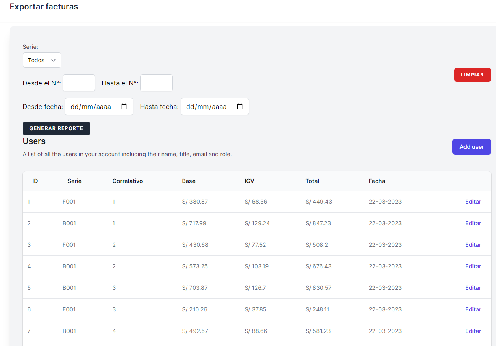

<div align="center">

<h1> REPORTE - FILTROS DINÁMICOS, IMPORTAR E IMPORTAR ARCHIVOS EXCEL Y CSV CON LARAVEL 10</h1>

## :point_right: Descripción del proyecto <a name = "descripcion_proyecto"></a>

<p>El proyecto consiste en listar, fitros dinámicos, importar e exportar archivos Excel y CSV. Está desarrollado con el STACK TALL(Tailwindcss - Alpine.js - Livewire - Laravel )
</p>
</div>
<div align="center">
<p align="center">
  <a href="" rel="noopener">
 </a>
</p>

## 🥇 DEMO 🥇 <a name = "demo"></a>

</br>

[]()
[](https://github.com/kylelobo/The-Documentation-Compendium/issues)
[](https://github.com/kylelobo/The-Documentation-Compendium/pulls)
[](/LICENSE)

</div>

---

## 📝 Tabla de contenido

-   [:point_right: Descripción del proyecto ](#point_right-descripción-del-proyecto-)
-   [🥇 DEMO 🥇 ](#-demo--)
-   [📝 Tabla de contenido](#-tabla-de-contenido)
-   [🏁 Primeros pasos ](#-primeros-pasos-)
    -   [:dart: Prerrequisitos ](#dart-prerrequisitos-)
    -   [🚀 Instalar ](#-instalar-)
    -   [🎈 Uso ](#-uso-)
-   [✍️ Autor ](#️-autor-)

## 🏁 Primeros pasos <a name = "primeros_pasos"></a>

Seguir los sucesivamente para levantar el proyecto en su servidor local.

### :dart: Prerrequisitos <a name = "prerrequisitos"></a>

-   Es necesario conocer del stack TALL en nivel básico
-   Editor de código
-   Muchas ganas de seguir aprendiendo 👍

### 🚀 Instalar <a name = "instalar"></a>

Seguir los siquientes pasos consecutivos

```
git clone https://gitlab.com/backend-laravel2/reportes-excel.git
```

### 🎈 Uso <a name="uso"></a>

-   En el terminal

    ```
    composer install
    cp .env.example .env
    php artisan key:generate
    ```

-   Crear tu base de datos
-   Cambiar los datos de usuario

    ```
    DB_DATABASE=reportes-excel
    DB_USERNAME=root
    DB_PASSWORD=
    ```

-   Cambiar el driver de local a public

    ```
    # FILESYSTEM_DISK=public
    ```

-   En el terminal
    ```
    php artisan migrate
    php artisan db:seed
    php artisan serve
    npm run dev
    ```
-   Opcional en el terminal
    ```
      php artisan storage:link
    ```
-   Para practicar
    -   Dentro de la carpeta pública/img existe los archivos Excel y CSV

## ✍️ Autor <a name = "autor"></a>

<div  align="center">

[](https://github.com/cybertcode)

[](https://github.com/cybertcode)

<p align="center">
   Mis redes sociales :<br/><br/>
    <a href="https://www.linkedin.com/in/marvyn-kevyn-huanca-hilario-a12699b7/"></a>
    <a href="https://www.instagram.com/mkevynhh"></a>
    <a href="https://gitlab.com/cybert22"></a>
    <a href="https://www.instagram.com/mkevynhh"></a>
    <a href="https://www.twitch.tv/cybert22"></a>
    <a href="https://twitter.com/Kevyn94"></a>
</p>

</div>

---

</br>
<p align="center"> © 2022 Cybertcode, todos los derechos Reservados. Hecho con ❤️ para una web mejor. </p>
<p align="center">
https://www.cybertcode.com
</p>
