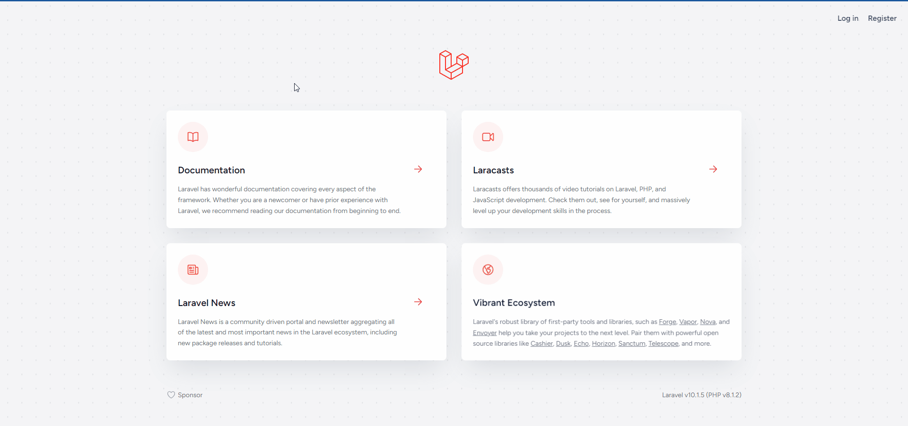

<div align="center">

<h1> REPORTE - FILTROS DINÁMICOS, IMPORTAR E IMPORTAR ARCHIVOS EXCEL Y CSV CON LARAVEL 10</h1>

[]()
[](https://github.com/kylelobo/The-Documentation-Compendium/issues)
[](https://github.com/kylelobo/The-Documentation-Compendium/pulls)
[](/LICENSE)

## 📖 Descripción del proyecto <a name="-descripción-del-proyecto-"></a>

<p>El proyecto consiste en: listar, fitros dinámicos, importar y exportar archivos Excel y CSV. Está desarrollado con el STACK TALL(Tailwindcss - Alpine.js - Livewire - Laravel )

## 🥇 DEMO 🥇 <a name="-demo--"></a>

</p>
</div>

<div align="center">
<p align="center">
  <a href="" rel="demo">
 </a>
</p>
</div>

---

<h2> 📝 <strong>Tabla de contenido</strong> </h2>

- [📖 Descripción del proyecto ](#-descripción-del-proyecto-)
- [🥇 DEMO 🥇 ](#-demo--)
- [🏁 **Requerimientos** ](#-requerimientos-)
- [🏅 **Tecnologías utilizados** ](#-tecnologías-utilizados-)
- [🚀 **Clonar** ](#-clonar-)
- [🖥️ **Uso** ](#️-uso-)
- [👨‍💻 **Desarrollador**](#-desarrollador)

## 🏁 **Requerimientos** <a name="-requerimientos-"></a>

-   Para correr la aplicación localmente, necesitarás tener instalado lo siguiente en tu máquina:

    -   PHP versión 8.1 o superior
    -   Composer
    -   MySQL
    -   Node
    -   Un servidor web (por ejemplo, Apache o Nginx

## 🏅 **Tecnologías utilizados** <a name="-tecnologías-utilizados-"></a>

-   `PHP` - Lenguaje de programación utilizado por Laravel.
-   `Laravel` - Framework PHP utilizado para desarrollar la aplicación.
-   `Livewire` - Biblioteca de Laravel para crear componentes de interfaces de usuario.
-   `Alpine.js` - Framework JavaScript para crear interactividad en el front-end.
-   `Tailwind CSS` - Framework CSS utilizado para el diseño de la interfaz.
-   `maatwebsite/excel` - Biblioteca de Laravel para gestionar archivos excel.

## 🚀 **Clonar** <a name="-clonar-"></a>

-   Clonar el repositorio

    ```
    https://github.com/cybertcode/REPORTE-EXPORTAR-E-IMPORTAR-ARCHIVOS-EXCEL-Y-CSV-EN-LARAVEL.git
    ```

## 🖥️ **Uso** <a name="-uso-"></a>

-   Ubicarse en el directorio del proyecto clonado
-   En el terminal

    ```
    composer install
    cp .env.example .env
    php artisan key:generate
    ```

-   **Crear tu base de datos**

    -   Configurar en el archivo .env

        ```
        DB_DATABASE=reportes-excel
        DB_USERNAME=root
        DB_PASSWORD=
        ```

    -   Cambiar el driver de local a public en el archivo .env

        ```
        # FILESYSTEM_DISK=public
        ```

    -   En el terminal

        ```
        php artisan migrate
        php artisan db:seed
        php artisan serve
        npm install
        npm run dev
        ```

    -   Opcional en el terminal
        ```
          php artisan storage:link
        ```

-   😎 **Para practicar**
    -   Dentro de la carpeta pública/img existe los archivos Excel y CSV
-   🔑 **Datos de acceso**
    -   Correo: **admin@admin.com**
    -   Contraseña: **admin123**

## 👨‍💻 **Desarrollador**<a name="-desarrollador"></a>

<div  align="center">

[](https://github.com/cybertcode)

[](https://github.com/cybertcode)

<p align="center">
   Mis redes sociales :<br/><br/>
    <a href="https://www.linkedin.com/in/marvyn-kevyn-huanca-hilario-a12699b7/"></a>
    <a href="https://www.facebook.com/profile.php?id=100047330599374"></a>
    <a href="https://gitlab.com/cybert22"></a>
    <a href="https://www.instagram.com/mkevynhh"></a>
    <a href="https://www.twitch.tv/cybert22"></a>
    <a href="https://twitter.com/Kevyn94"></a>
</p>

</div>

---

</br>
<div align="center">
<p align="center"> © 2023 Cybertcode, todos los derechos Reservados. Hecho con mucho ❤️ . </p>
<p align="center">
https://www.cybertcode.com
</p>
</div>
